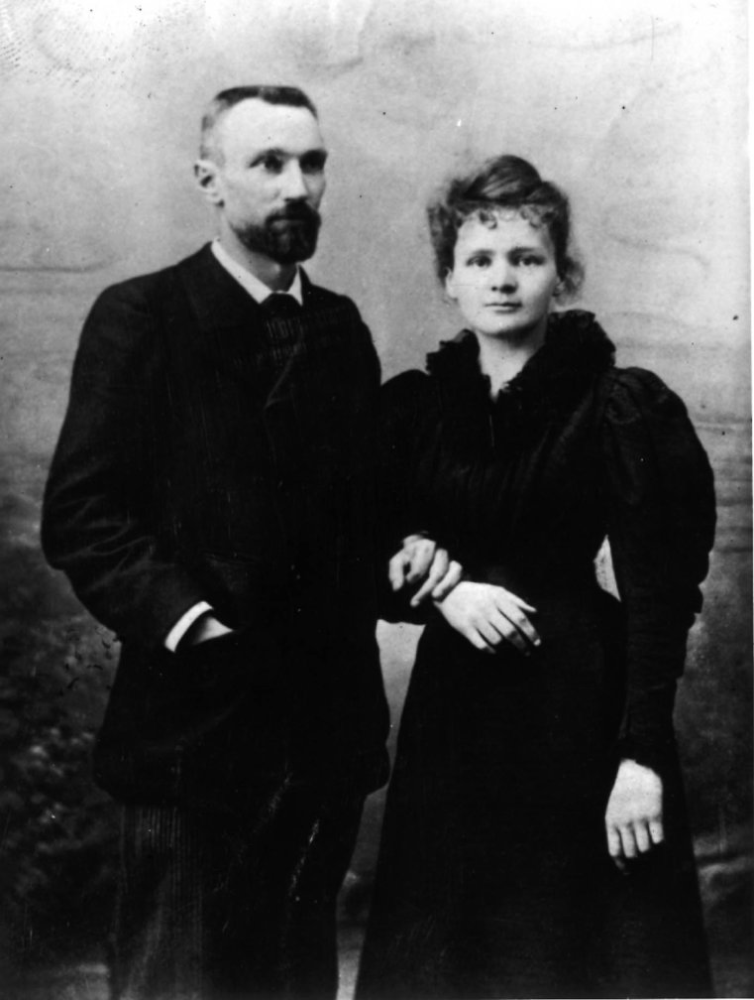
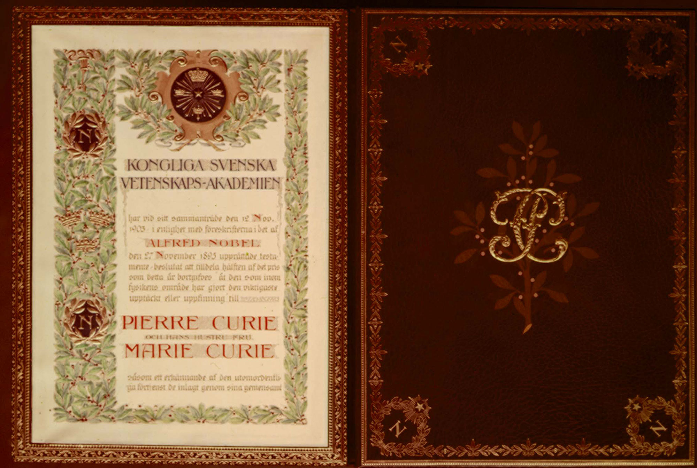
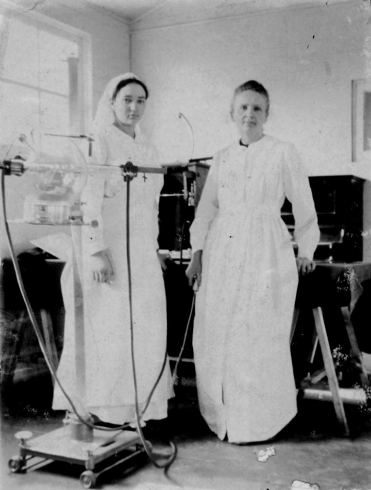

  

    

      

        

          

            

              <h3 class="heading-2"> </h3>
              <h1 class="hero-title nohome">Marie Curie </h1>
            

            

              
Curiefense is named in her honor. 

            

            

          

        

        

          

        

      

    

  

  

  

    

      

        

          <h3 class="heading-2">Namesake</h3>
          
The Curiefense project is named after the famous scientist Marie Skłodowska Curie. Its initial development took place in intensive sessions in Malakoff France, close to her house and laboratory, and it was released on November 7, her birthday.   We hope that in some small way, the project’s name can remind people today of this exceptional researcher, humanitarian, and Nobel Laureate: the only person in history to have won Nobel prizes in two different sciences (Physics and Chemistry).  

          <ul role="list" class="list"></ul>
        

      

      

      

        

      

    

    

      

        

          <h3 class="heading-2">Early Life</h3>
          
She was born on November 7, 1867, in Warsaw, Congress Kingdom of Poland (then part of the Russian Empire). Even in her adolescence, her intellect and prodigious memory were obvious; at the age of 16 she won a gold medal on completion of her secondary education at the Russian lycée. ‍ In 1891 she moved to France to study at the University of Paris, eventually earning a doctorate.  

        

      

      

      

        

      

    

  

  

    

      

        

          <h3 class="heading-2 contrast">Collaboration with Pierre Curie</h3>
          
While still a student in Paris, she met Pierre Curie; the two were married in 1895, the year he received his own Ph.D.   Together they had two daughters (Irène in 1897 and Ève in 1904), and produced a remarkable number of discoveries. They worked closely together until his untimely death in 1906. 

        

      

      

      

        

      

    

    

      

        

          <h3 class="heading-2 contrast">Scientific Achievements</h3>
          
Madame Curie’s scientific accomplishments include: 

        

        <ul role="list" class="list contrast">
          <li class="list-item alt">
            
Early discoveries about the nature of radioactivity (a term coined by her and her husband)

          </li>
          <li class="list-item alt">
            
Discovery of the element polonium (named after her native Poland)

          </li>
          <li class="list-item alt">
            
Discovery of the element radium

          </li>
          <li class="list-item alt">
            
Being awarded (jointly with Pierre Curie and Henri Becquerel) the 1903 Nobel Prize in Physics, for their investigations into radioactivity

          </li>
          <li class="list-item alt">
            
Being awarded (jointly with Pierre) the Davy Medal of the Royal Society in 1903

          </li>
          <li class="list-item alt">
            
Being awarded (as the sole recipient) the 1911 Nobel Prize in Chemistry for the discovery of polonium and radium. 

          </li>
        </ul>
        
Madame Curie was the first person in history to win two Nobel Prizes, and she remains the only person to become a Nobel Laureate in two different sciences. 

      

      

      

        

      

    

  

  

    

      

        

          <h3 class="heading-2">Medical Achievements</h3>
          
She also made important advancements in medicine, including research showing that radium could be used to treat cancer. She founded the Radium Institute, which later was renamed to the Curie Institute—one of the world’s leading oncology centers today. 

        

      

      

      

        

      

    

    

      

        

          <h3 class="heading-2">Societal Barriers</h3>
          
Mme. Curie broke through the societal and sexist barriers that were prevalent during her day. She was: 

          <ul role="list" class="list">
            <li class="list-item alt">
              
The first woman to receive a Ph.D. from a French university

            </li>
            <li class="list-item alt">
              
The first woman to be employed as a professor at the University of Paris

            </li>
            <li class="list-item alt">
              
The first female member of The Royal Danish Academy of Sciences and Letters

            </li>
            <li class="list-item alt">
              
The first woman to receive a Nobel Prize (despite the initial reluctance of the nominating committee to include her in the nomination).

            </li>
          </ul>
        

      

      

      

        

      

    

  

  

    

      

        

          <h3 class="heading-2 contrast">Humanitarian</h3>
          
Along with her many scientific achievements, Madame Curie is also known for her humanitarian work. Early on, she realized that radiology could be used by military doctors as they worked to save the lives and limbs of wounded soldiers. During the first World War, she formed France&#x27;s first military radiology center, and her mobile radiography units became known as <em>petites Curies</em> (“Little Curies”). Often, she herself drove one of these units to the front lines. It is estimated that over a million wounded soldiers were treated with her X-ray units. 

        

      

      

      

        

      

    

    

      

        

          <h3 class="heading-2 contrast">Life and Legacy</h3>
          
Ultimately, Madame Curie’s dedication to science and the service of humanity took most of her eyesight, and then her life. In her day, the dangers of radioactivity were not yet understood; she received high levels of exposure in the laboratory and also from unshielded X-ray equipment during the war. (Even today, her laboratory notes are still so contaminated that they are stored in lead-lined boxes, and researchers must wear protective clothing when reading them.) As a result, she suffered from several chronic illnesses, including near-blindness from cataracts. Eventually, aplastic anaemia (believed to be the result of radiation exposure) took her life.  Mme. Curie’s formidable intellect was matched only by her tireless work and service to humanity. Her legacy lives on today in many areas of science and medicine. 

        

      

      

      

        

      

    

  

